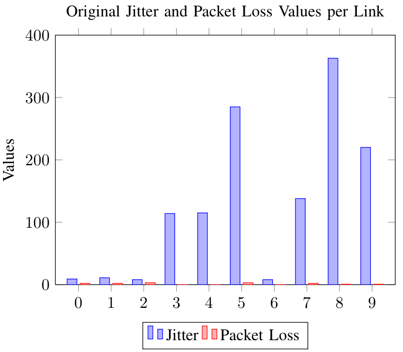
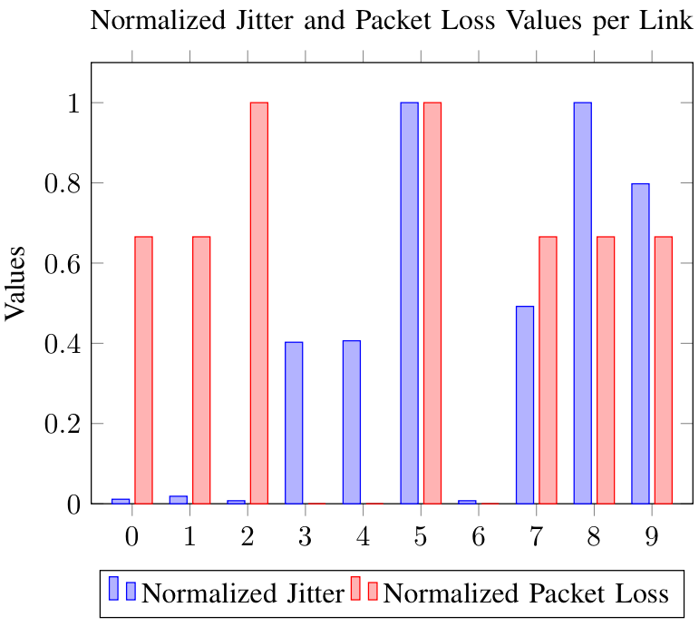

# Telemetry to Arango Processor

## Overview
The Telemetry to Arango Processor is designed to enrich BMP data stored in the graph database with additional data received via streaming telemetry (MDT/YANG-PUSH).


## Components

The telemetry to Arango processor consists of several key components:

- **Kafka Consumer**: Consumes interface data from Kafka in an event-driven manner and forwards it to the telemetry to Arango processor. This allows it to respond to changes in interface status or IPv6 addresses.
  
- **Influx Client**: Periodically consumes time series data from InfluxDB, with the period defined by the `interval` setting in the configuration file.
  
- **Arango Client**: Updates links in the graph database with the specific calculated values.

- **Kafka Producer**: Produces and sends messages about updated links to inform other systems of the changes. Additionally, it sends normalization data to Kafka, which is then forwarded to InfluxDB.

These components work together to enrich links with data from InfluxDB, enhancing the overall dataset.

## Functionality
The Telemetry to Arango Processor enriches BMP data stored in the graph database with additional data received via streaming telemetry (MDT/YANG-PUSH). This ensures comprehensive data processing by combining link data stored in Jalapeno's graph database with performance measurement data from Jalapeno's time series database.

Network link data received via BMP contains interface IPv6 addresses but lacks interface names, while performance measurements received via streaming telemetry include interface names but no IPv6 addresses. Bridging these two data sets involves configuring network devices to send information about interfaces, including names, status, IPv6 addresses, and related changes via streaming telemetry.

The processor retrieves this status information through Jalapeno, allowing it to correlate the two data collections. The service maps performance measurements to the interface name and subsequently maps the interface name to the IPv6 address. The IPv6 address is then used to locate the appropriate link entry in the graph database and append the network's latest performance data.

The processor can perform various operations, such as calculating the mean, median, maximum, and minimum, or obtaining the last measurement of a dataset within a specific period. These operations are performed repeatedly at intervals defined by the operator, ensuring continuous updates and accurate data representation in the system. This capability renders the processor versatile, enabling efficient data integration into the graph database.

## Standard Format


## Normalization Process

The telemetry to Arango processor applies IQR-based min-max normalization to latency, jitter and packet loss metrics so that they can be combined in a weighted dijkstra algorithm. The normalization analyzes the network data monitored in the last interval and normalizes the data to a [0, 1] interval.
The normalization process involves the following steps: 

### Interquartile Range (IQR) Calculation
- The processor calculates the quartiles (Q1, Q2/Median, and Q3) of the data.
- The **Interquartile Range (IQR)** is calculated as the difference between Q3 and Q1, representing the range within which the middle 50% of the data lies.
  
### Fence Calculation
- **Lower Fence**: Calculated as `Q1 - 1.5 * IQR`, but adjusted to be no less than the minimum value in the data set.
- **Upper Fence**: Calculated as `Q3 + 1.5 * IQR`, but adjusted to be no greater than the maximum value in the data set.

This adjustment ensures that the fences are within the actual data range, preventing extreme values from unduly influencing the normalization process.

### Normalization to [0, 1] Interval
- **Value Mapping**: Each data point is mapped to a value between 0 and 1 based on its position relative to the lower and upper fences.
- **Handling Out-of-Bounds Values**:
  - Values below the lower fence are normalized to a small positive value (e.g., 0.00001) because ArangoDB does not accept zero as a valid value.
  - Values above the upper fence are normalized to 1.

This approach ensures that all data points are normalized to the [0, 1] interval, making the data consistent and easier to analyze. This normalization is crucial for performing accurate weighted shortest path calculations, where normalized weights allow for proper comparison and routing decisions, while also managing outliers effectively.

### Example
In the example below, the original jitter and packet loss metrics are normalized using the IQR-based min-max normalization process.
The normalized values in the right image show a stark contrast compared to the original values in the left image, making them more suitable for combined calculations. Packet loss values, which are barely visible in the left image, are mapped to values close to 1 in the right image, highlighting the higher packet loss relative to other network measurements. The handling of outliers is also evident; for instance, links 5 and 7 in the left image exceed the normalization upper fence and are both mapped to 1 in the right image.

Original Jitter and Packet Loss Metrics             |  Normalized Jitter and Packet Loss Metrics
:-------------------------:|:-------------------------:
 |  

## Prerequisites
Ensure you have the Kafka, Influx and Kafka up and running. For further documentation look at the [deployment guide](https://github.com/hawkv6/deployment) to install and configure the K8S resources.


## Configuration

The following configuration parameters are required for the telemetry to Arango processor.

### Input Configuration

#### Kafka Configuration
- **\<kafka-input-name>**:
  - **broker**: Specify the Kafka broker address (e.g., `broker-hostname:port`).
  - **topic**: The name of the Kafka topic to consume interface data from.

This Kafka input configuration is used to consume interface data from the specified Kafka topic.

#### InfluxDB Configuration
- **\<influxdb-input-name>**:
  - **url**: The URL of the InfluxDB instance (e.g., `http://influxdb-hostname:port`).
  - **db**: The name of the database in InfluxDB to query from.
  - **username**: The username to authenticate with InfluxDB.
  - **password**: The password associated with the username.

This InfluxDB input configuration is used to periodically consume time series data from the specified InfluxDB database.

### Output Configuration

#### ArangoDB Output
- **\<arango-output-name>**:
  - **url**: The URL of the ArangoDB instance (e.g., `https://arangodb-hostname/`).
  - **database**: The name of the database in ArangoDB to update.
  - **username**: The username to authenticate with ArangoDB.
  - **password**: The password associated with the username.
  - **skip_tls_verification**: A boolean value (`true` or `false`) to specify whether to skip TLS verification.

This configuration defines how processed data is stored in the specified ArangoDB instance.

#### Kafka Output Configuration
- **\<kafka-output-event-name>**:
  - **broker**: Specify the Kafka broker address (e.g., `broker-hostname:port`).
  - **topic**: The name of the Kafka topic to send event notifications to.
  - **type**: The type of Kafka output, typically `event-notification`.

This Kafka output configuration is used to send link update events.

- **\<kafka-output-normalization-name>**:
  - **broker**: Specify the Kafka broker address (e.g., `broker-hostname:port`).
  - **topic**: The name of the Kafka topic to send normalized telemetry metrics to.
  - **type**: The type of Kafka output, typically `normalization`.

This Kafka output configuration is used to send normalized telemetry metrics.

### Processor Configuration

#### TelemetryToArango Processor
- **\<processor-name>**:
  - **inputs**:
    - List the names of the input configurations defined above (e.g., `<kafka-input-name>`, `<influxdb-input-name>`).
  - **outputs**:
    - List the names of the output configurations defined above (e.g., `<arango-output-name>`, `<kafka-output-event-name>`, `<kafka-output-normalization-name>`).
  - **interval**: Define the processing interval in seconds (e.g., `30` seconds).
  - **normalization**:
    - **field-mappings**:
      - Specify the mapping between input fields and normalized fields (e.g., `input-field-name`: `normalized-field-name`).
  - **modes**:
    - **input-options**:
      - **<influxdb-input-name>**:
        - **measurement**: Specify the InfluxDB measurement to query from.
        - **field**: The field within the measurement to be processed.
        - **method**: The aggregation method to apply (e.g., `median`, `mean`, `max`, `min`, `last`).
        - **group_by**: List the fields to group the data by (e.g., `interface_name`, `source`).
    - **output-options**:
      - **<arango-output-name>**:
        - **collection**: The name of the ArangoDB collection to update.
        - **method**: The method to use for updating the collection (e.g., `update`).
        - **filter_by**: List the fields to filter the data by before updating (e.g., `local_link_ip`).
        - **field**: The field in the ArangoDB collection to update with the processed data.

This processor configuration defines how telemetry data is processed, including mapping fields from InfluxDB measurements to corresponding fields in ArangoDB collections. An example configuration can be found in the `config` folder.

### YANG Models

The following YANG model configuration is used on IOS-XR:

```bash
sensor-group openconfig_interfaces
  sensor-path openconfig-interfaces:interfaces/interface/state/oper-status
  sensor-path openconfig-interfaces:interfaces/interface/subinterfaces/subinterface/openconfig-if-ip:ipv6/addresses/address
```
